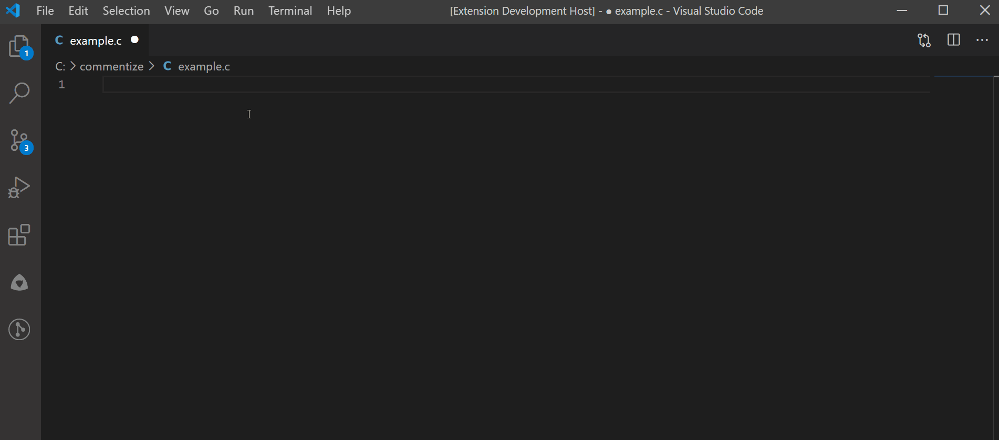
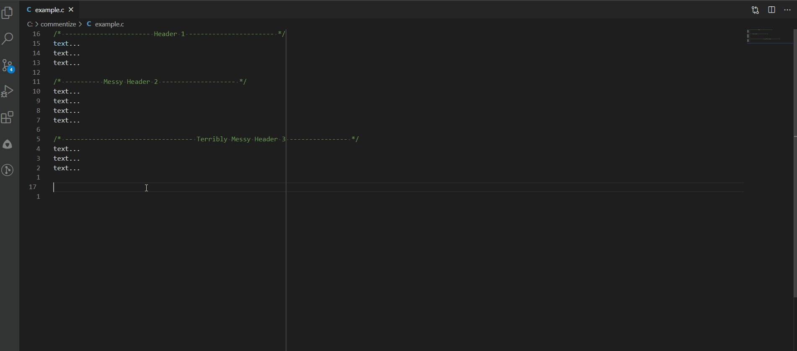

# Commentize

The Commentize extension will help you keep your c-style comment headers clean. Set your comments style configuration and start creating & formatting your comments easily! 

## Features

After configuring your comment styles, you'll be able to turn any text to an aligned comment header of your choice with a simple key-binding.



Furthermore, when editing a file which contains comment headers, Commentize will find & format those headers for you based on your comment styles.



## Configuration

This extension can be configured in User Settings or Workspace settings.

`"commentize.lineLength": 120`  
 This will be set as the default line length of every comment (unless overwritten by a specific comment configuration).

`commentize.commentsConfigs`  
The comment configs are the comment styles the extension will help you handle.

```json
"commentize.commentConfigs": [
  {
      "name": "/* ---- h1 ---- */",
      "fillChar": "-",
      "alignment": "center",
      "isEdgeSpaces": true,
      "isTextSpaces": true
  },
  {
      "name": "/***** h2 *****/",
      "fillChar": "*",
      "alignment": "center",
      "isEdgeSpaces": false,
      "isTextSpaces": true,
      "lineLength"?: 80
  }
]
```

> Note: no restart is required when configuration are changed!

## Usage

This extension is not published to the VSCode extensions marketplace. You can generate a `.vsix` package using `vsce`:

```
// install vsce (make sure Node.js is installed)
$ npm install -g vsce

// generate commentize.vsix
$ vsce package
```
